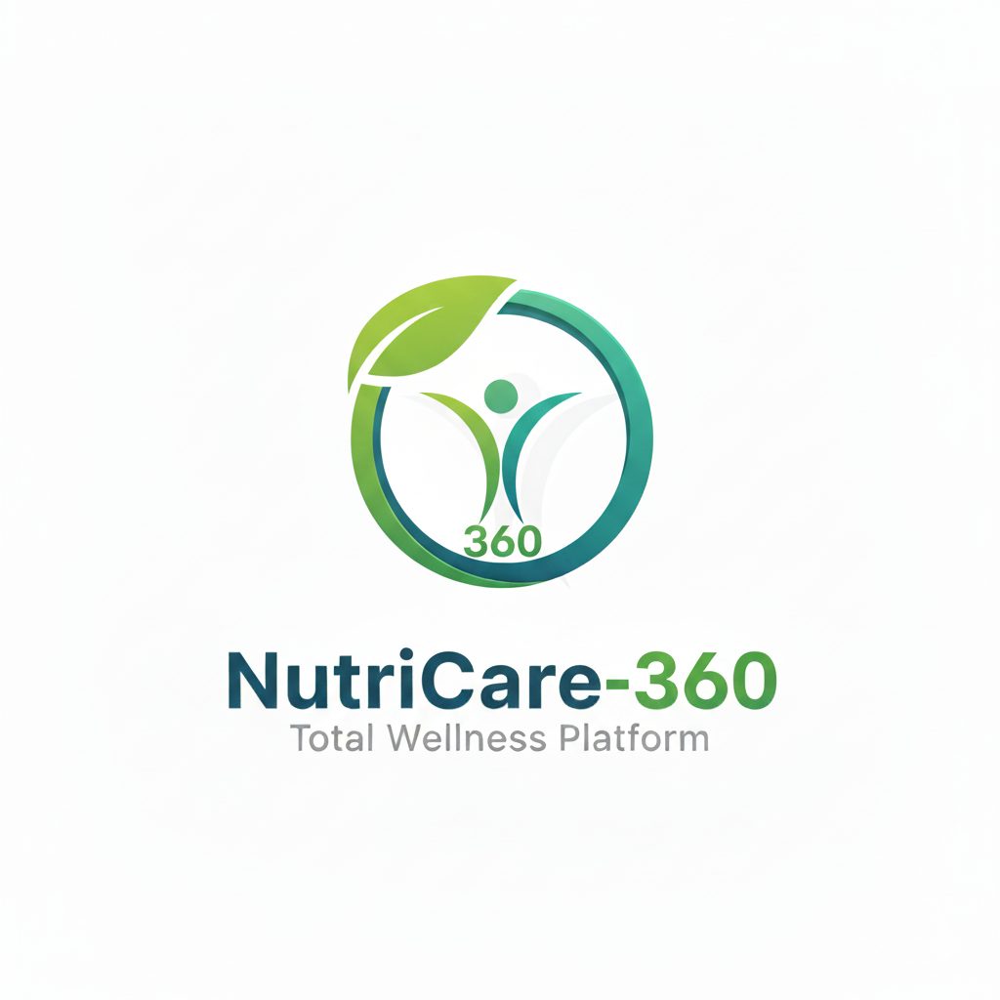
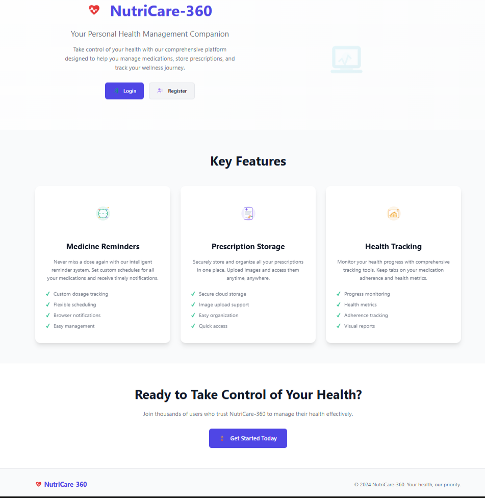
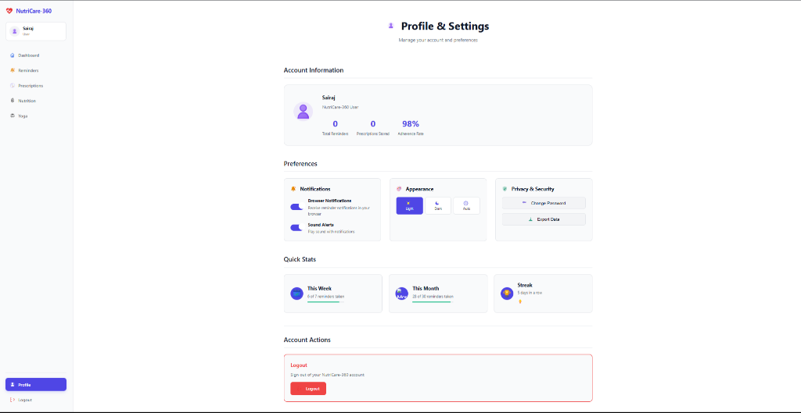
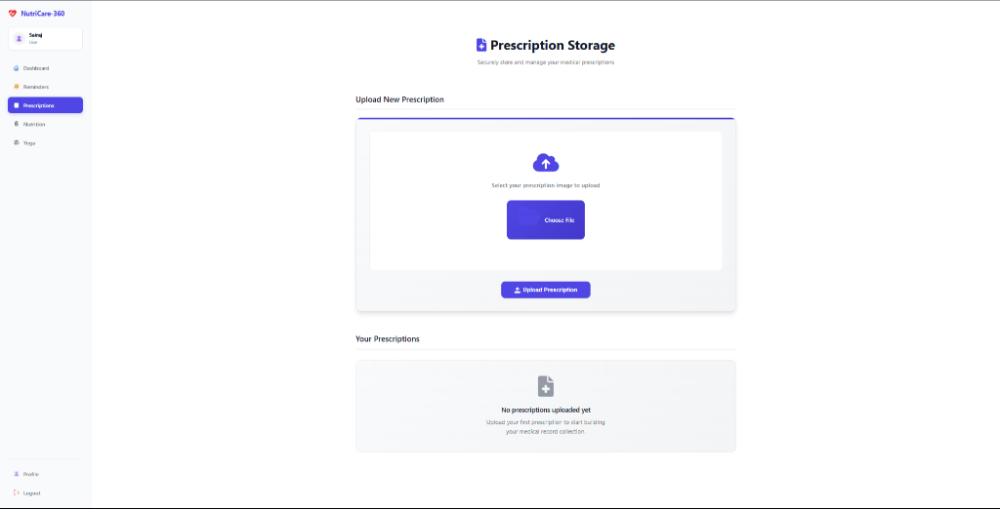
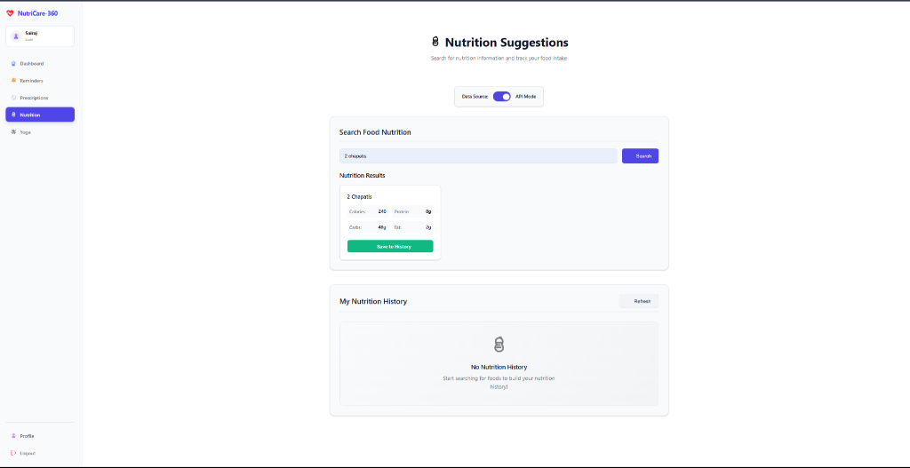
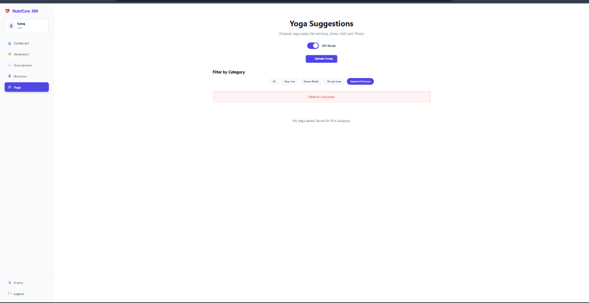

<div align="center">

<table>
<tr>
<td width="30%" align="center">
  
  <h2>NUTRICARE-360</h2>
  <p><strong>SMART HEALTHCARE MANAGEMENT SYSTEM</strong></p>
</td>
<td width="70%">
  <h1>🏥 NUTRICARE-360</h1>
  <hr/>
  <h3>Comprehensive Healthcare Management Platform For Better Living</h3>
  <hr/>
  <p>Empowering individuals with integrated health tracking through prescriptions, reminders, nutrition monitoring and wellness practices</p>
  <p>
    
    
    
    
  </p>
</td>
</tr>
</table>

</div>

---

# 🏥 NutriCare-360 - Healthcare Management System

A comprehensive web-based healthcare management platform built with Flask that helps users manage their medical information, prescriptions, reminders, nutrition, and wellness activities including yoga practices.

## 🌟 Features

### 🔐 User Authentication & Security
- **Secure Registration & Login** - User account creation with password protection
- **Session Management** - Secure user sessions with logout functionality
- **Profile Management** - Personal information and settings management

### 💊 Health Management
- **Prescription Tracking** - Manage and track medications and prescriptions
- **Medical Reminders** - Set up and receive notifications for medications and appointments
- **Health Dashboard** - Centralized view of all health-related information

### 🥗 Nutrition & Wellness
- **Nutrition Tracker** - Monitor daily nutrition intake and dietary habits
- **Yoga Practice** - Comprehensive yoga pose library with traditional Sanskrit names
  - 22+ yoga poses across multiple categories
  - Detailed instructions and benefits
  - Filter by category (Beginner, Stress Relief, Weight Loss, etc.)
  - Traditional poses like Surya Namaskara, Padmasana, Sirsasana

### 🎨 User Experience
- **Dark/Light Theme Toggle** - Customizable interface themes
- **Responsive Design** - Works seamlessly on desktop and mobile devices
- **Intuitive Navigation** - Organized navbar with logical groupings
- **Modern UI** - Clean, professional healthcare-focused design

## 📸 Screenshots

### Landing Page


### Dashboard & Health Management
<div style="display: flex; gap: 10px;">
    
    
</div>

### Wellness Features
<div style="display: flex; gap: 10px;">
    
    
</div>


## 🚀 Quick Start

### Prerequisites
- Python 3.7 or higher
- pip (Python package installer)

### Installation

1. **Clone the repository**
   ```bash
   git clone https://github.com/SairajJadhav08/NutriCare-360.git
   cd NutriCare-360
   ```

2. **Install dependencies**
   ```bash
   pip install -r requirements.txt
   ```

3. **Run the application**
   ```bash
   python app.py
   ```

4. **Access the application**
   Open your web browser and navigate to `http://localhost:5000`

## 📁 Project Structure

```
NutriCare-360/
├── app.py                 # Main Flask application
├── nutricare360.db           # SQLite database
├── requirements.txt      # Python dependencies
├── static/               # Static assets
│   ├── css/
│   │   └── style.css    # Main stylesheet
│   ├── data/
│   │   ├── nutrition.json # Nutrition data
│   │   └── yoga.json     # Yoga poses data
│   ├── icons/           # Custom icons
│   └── js/
│       └── app.js       # Frontend JavaScript
├── templates/           # HTML templates
│   ├── base.html       # Base template
│   ├── dashboard.html  # Main dashboard
│   ├── login.html      # Login page
│   ├── register.html   # Registration page
│   ├── prescriptions.html
│   ├── reminders.html
│   ├── nutrition.html
│   ├── yoga.html       # Yoga practice page
│   └── profile.html
└── README.md           # Project documentation
```

## 🧘‍♀️ Yoga Feature Highlights

The yoga section includes traditional poses with authentic Sanskrit names:

### Categories Available:
- **Beginner** - Foundation poses for newcomers
- **Stress Relief** - Calming poses for relaxation
- **Weight Loss** - Dynamic poses for fitness
- **Strength** - Poses that build physical strength
- **Flexibility** - Poses that improve mobility
- **Back Pain** - Therapeutic poses for back health
- **Heart Opening** - Backbends that open the chest
- **Inversion** - Poses that reverse blood flow
- **Balance** - Poses that improve stability
- **Advanced** - Challenging poses for experienced practitioners
- **Relaxation** - Restorative poses for recovery

### Featured Traditional Poses:
- **Surya Namaskara** (Sun Salutation) - Complete 12-pose sequence
- **Padmasana** (Lotus Pose) - Classic meditation pose
- **Sirsasana** (Headstand) - The king of all poses
- **Vrikshasana** (Tree Pose) - Standing balance pose
- **Bhujangasana** (Cobra Pose) - Gentle backbend
- And many more authentic yoga practices

## 🛠️ Technology Stack

- **Backend**: Flask (Python web framework)
- **Database**: SQLite (lightweight database)
- **Frontend**: HTML5, CSS3, JavaScript
- **Styling**: Custom CSS with dark/light theme support
- **Icons**: Custom SVG icons
- **Data**: JSON-based data storage for yoga and nutrition

## 🎯 Usage Guide

### Getting Started
1. **Register** a new account or **login** with existing credentials
2. **Explore the Dashboard** to get an overview of your health data
3. **Set up Reminders** for medications and appointments
4. **Track Prescriptions** and manage your medications
5. **Monitor Nutrition** and dietary habits
6. **Practice Yoga** with guided poses and instructions

### Navigation Structure
- **Dashboard** - Main overview and quick access
- **Health Management** - Reminders and Prescriptions
- **Wellness & Lifestyle** - Nutrition and Yoga
- **User Settings** - Profile, Theme, and Logout

## 🔧 Configuration

### Database Setup
The application uses SQLite database (`nutricare360.db`) which is automatically created when you first run the application.

### Theme Customization
Users can toggle between light and dark themes using the theme toggle in the navigation bar.

## 🤝 Contributing

1. Fork the repository
2. Create a feature branch (`git checkout -b feature/AmazingFeature`)
3. Commit your changes (`git commit -m 'Add some AmazingFeature'`)
4. Push to the branch (`git push origin feature/AmazingFeature`)
5. Open a Pull Request

## 📝 License

This project is open source and available under the [MIT License](LICENSE).

## 👨‍💻 Author

**Sairaj Jadhav**
- GitHub: [@SairajJadhav08](https://github.com/SairajJadhav08)

## 🙏 Acknowledgments

- Traditional yoga poses and Sanskrit names from authentic yoga traditions
- Modern healthcare management principles
- Flask community for excellent documentation and support

## 📞 Support

If you encounter any issues or have questions, please:
1. Check the existing issues on GitHub
2. Create a new issue with detailed description
3. Contact the maintainer through GitHub

---

**NutriCare-360** - Your comprehensive healthcare companion 🏥✨