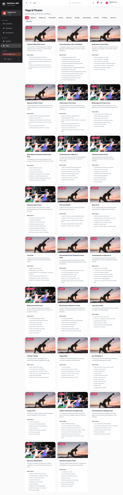

# NutriCare-360 🌿

Welcome to **NutriCare-360**, a full-stack health and wellness application designed to help you track and improve your well-being! Whether it's managing your daily nutrition, keeping up with your yoga routine, or organizing reminders and prescriptions, NutriCare-360 has got you covered.

This project is built to be simple and beginner-friendly, providing a clean dashboard where you can easily keep an eye on your lifestyle and medical routines.

---

## 📸 Screenshots

Here is a glimpse of what NutriCare-360 looks like:

### Landing Page


### Yoga & Wellness


---

## ✨ Features

- **Dashboard:** Get a complete overview of your health status, online status, and daily tasks.
- **Nutrition:** Track and plan your healthy lifestyle choices.
- **Yoga:** Specific modules geared towards mindfulness and physical exercises.
- **Prescriptions & Reminders:** Keep a log of your medical prescriptions and stay on top of notifications so you never miss a dose.
- **User Profiles:** Personalized avatars, role displays, and custom settings.
- **Light / Dark Mode:** Easy on the eyes, switch themes to match your preference!

---

## 💻 Tech Stack

This project uses modern and simple web development tools. 

- **Frontend:** Built with [React](https://react.dev/) and powered by [Vite](https://vitejs.dev/) for quick and fast rendering. Uses vanilla CSS for styling.
- **Backend:** Powered by **Python** (via `app.py`, usually utilizing a framework like Flask or FastAPI).
- **Database:** Uses a simple **SQLite** database (`nutricare360.db`) to safely store your user profiles, reminders, and health data locally.

---

## 🚀 How to Run the Project Locally (For Beginners)

Since this project has both a **Frontend** (what you see) and a **Backend** (how data is processed), you'll need to run them both side-by-side in two separate terminal windows.

### 1. Start the Backend Server (Python)
The backend provides all the data to our web application.
1. Open your terminal or command prompt.
2. Navigate to the `backend` folder:
   ```bash
   cd backend
   ```
3. Install the required tools (only needed the first time):
   ```bash
   pip install -r requirements.txt
   ```
4. Run the Python application:
   ```bash
   python app.py
   ```
   *Your backend server should now be running! Keep this terminal open.*

### 2. Start the Frontend App (React UI)
Now let's start the actual graphical interface.
1. Open a **new** terminal window.
2. Navigate to the `frontend` folder:
   ```bash
   cd frontend
   ```
3. Install the required Node packages (only needed the first time):
   ```bash
   npm install
   ```
4. Start the development server:
   ```bash
   npm run dev
   ```
   *The terminal will provide you with a local link (usually `http://localhost:5173`). Open that in your browser to see the app!*

---

## 🤝 Contributing

Feel free to fork this project, make changes, and build upon it! It's an excellent way to learn React and Python integration. Happy coding!