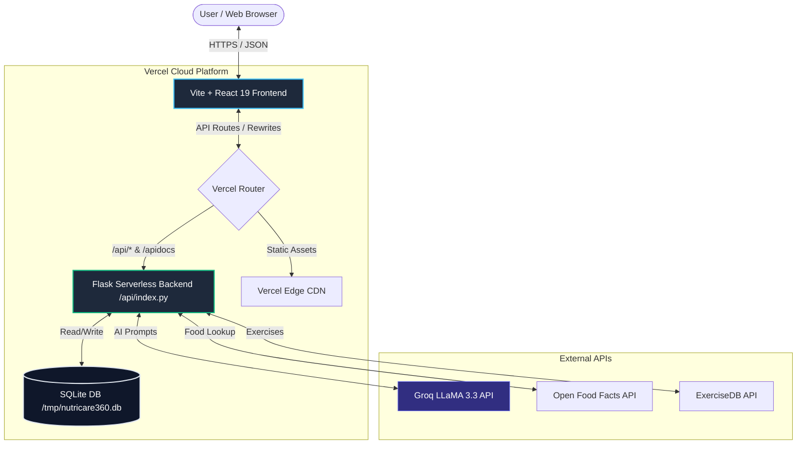
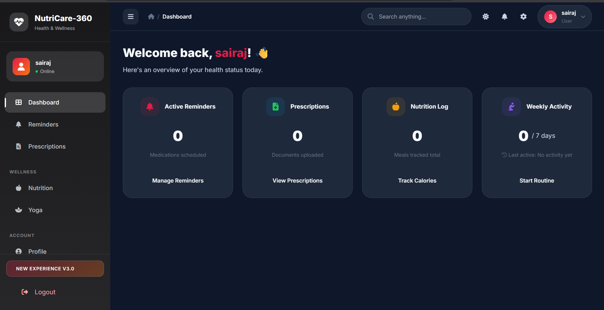
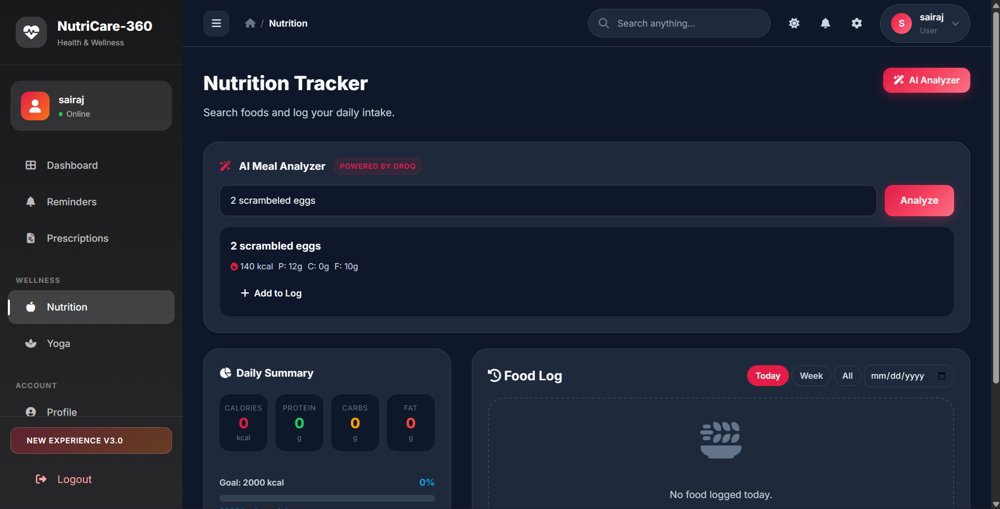
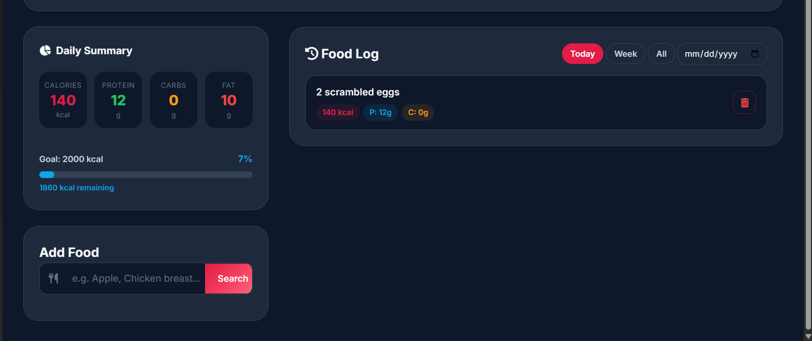
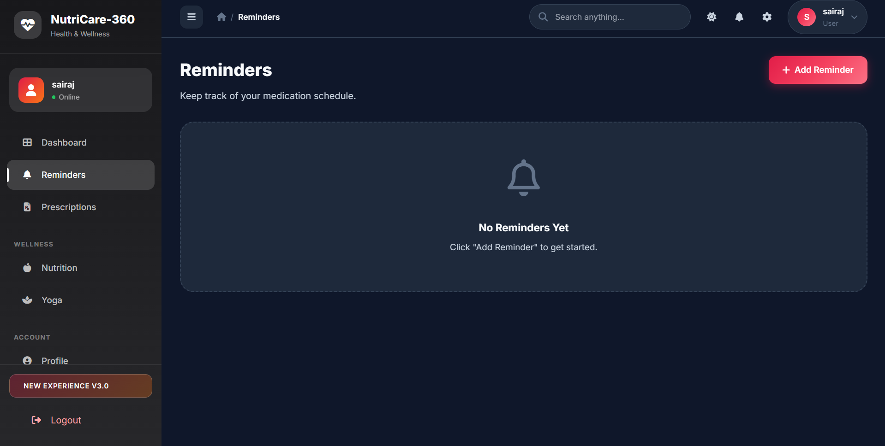
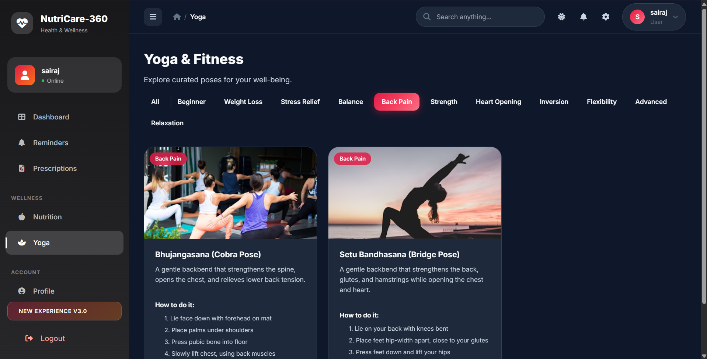
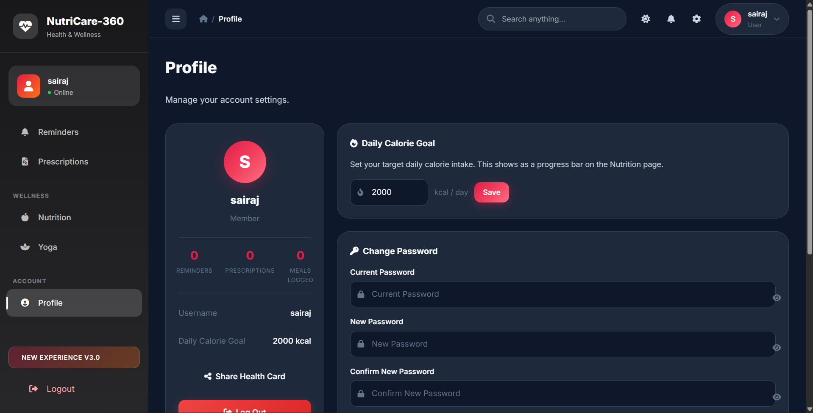

# Case Study: NutriCare-360


> **🔗 Quick Links**
> * 🚀 **[Live Demo](https://nutri-care-360.vercel.app/)**
> * 📖 **[Interactive API Docs (Swagger)](https://nutri-care-360.vercel.app/apidocs)**
> * 💻 **[Source Code & README](../README.md)**

---

## 1. Executive Summary

**NutriCare-360** is a comprehensive, full-stack personal health and wellness ecosystem. It consolidates historically fragmented tasks—such as tracking daily nutrition, managing medicine schedules, storing prescription files, and learning fitness/yoga routines—into a single, high-fidelity dashboard. 

By integrating state-of-the-art AI-driven meal analysis (powered by Groq and LLaMA) and utilizing a hybrid deployment strategy on Vercel, the platform delivers a fast, resilient, and responsive user experience. 

---

## 2. System Architecture

The application is built using a modern decoupled architecture: a **Vite + React 19** frontend, and a **Python Flask** serverless backend. Data persistence is managed via an optimized **SQLite** database, dynamically configured for serverless runtime restrictions.



### Key Architectural Layers:
* **Frontend:** React 19 utilizing custom contexts for global state (Auth, Theme, Toast notifications) and Tailwind CSS + Custom CSS for glassmorphism.
* **Serverless Backend:** Flask routes handled as Vercel serverless functions, translating requests and interfacing with third-party APIs.
* **Database Management:** SQLite used directly. To satisfy Vercel's ephemeral and read-only container structure, the database is dynamically initialized in `/tmp/` on container cold starts, with key configuration schemas bootstrapped programmatically.

---

## 3. Core Features & Interface Showcase

### 📊 Consolidated Health Dashboard
A central hub that gives users an immediate status report of their active medicine reminders, prescriptions uploaded, today's caloric intake progress, and yoga activity streak. 



---

### 🪄 AI-Powered Meal Analyzer (Groq Integration)
Instead of searching databases for ingredients one-by-one, users can type their entire meal in plain English. The backend utilizes **Groq's LLaMA-3.3-70b-versatile model** to extract structured macronutrient estimates (Calories, Carbs, Protein, Fat) and returns a JSON payload that can be saved directly to the log with a single click.




---

### ⏰ Smart Medicine Reminders
Allows users to build custom medication schedules with dosage, frequency, and time. Features a daily "mark-as-taken" log and dynamically tracks adherence stats.



---

### 🧘 Yoga & Curated Fitness Library
An exercise posing guide featuring category filters, step-by-step instructions, and visuals. Integrates Evolution/ExerciseDB APIs, with a robust local fallback system.



---

### ⚙️ Customizable Profiles & Health Cards
Users can change their daily caloric targets, update credentials, and generate a dynamic **Health Card** (canvas-rendered PNG) summarizing their health details for quick sharing with doctors.



---

## 4. Technical Challenges & Engineering Solutions

### Challenge A: SQLite Write Constraints in Serverless Containers
**The Problem:** Vercel functions run in read-only sandboxes. Placing the SQLite database inside the deployed project directory caused `sqlite3.ReadOnlyError: attempt to write a readonly database` when users tried to register or save logs.
**The Solution:** Implemented dynamic environment checks. If running in a Vercel production container, the app mounts the database path (`DB_PATH`) to the `/tmp/` directory (the only writable directory in AWS Lambda/Vercel serverless containers).
```python
if os.environ.get('VERCEL') == '1' or os.environ.get('VERCEL_ENV'):
    VOLUME_MOUNT = '/tmp'
else:
    VOLUME_MOUNT = BASE_DIR
DB_PATH = os.path.join(VOLUME_MOUNT, 'nutricare360.db')
```

### Challenge B: Initializing Database Schema without Terminal Access
**The Problem:** Because serverless containers boot up on-demand (cold starts), the database in `/tmp/` is initially empty, causing query crashes because tables like `users` or `reminders` do not exist.
**The Solution:** Moved the database initialization logic (`init_db()`) to the module level in the Flask entrypoint. This guarantees that every cold start immediately bootstraps the database schema in `/tmp/` before processing any incoming HTTP requests, eliminating database access failures.

### Challenge C: Robust Third-Party API Fallbacks
**The Problem:** Network instability or rate-limiting of free API tiers (like ExerciseDB on RapidAPI) can break core features like the Yoga and Fitness library.
**The Solution:** Implemented defensive code patterns. The API layer wraps external requests in try-except blocks and automatically falls back to curated static JSON assets stored in `api/static/data/` if external APIs are unconfigured or fail.

---

## 5. Security & Development Experience (DX)

* **State Management:** Secure authentication is implemented via **JWT Tokens (JSON Web Tokens)** stored in secure contexts, featuring a custom `useApi` hook to inject Authorization headers and handle expired sessions gracefully.
* **Interactive API Playground:** Integrated **Flasgger (Swagger OpenAPI 3.0)** directly inside the Flask server. Developers can explore the backend endpoints, parameter schemas, and test responses interactively at `/apidocs`.
